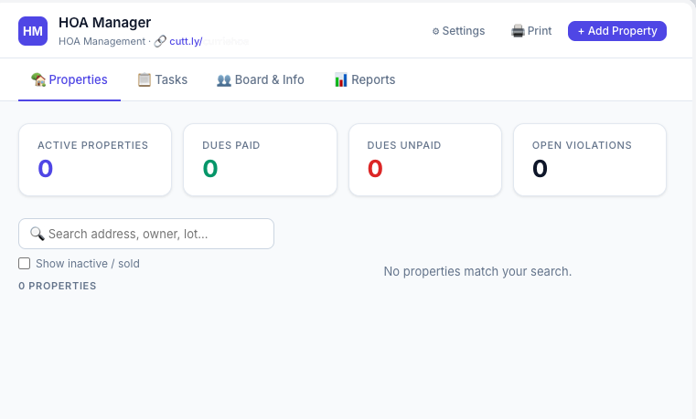

# HOA Manager

A free, self-hosted web app for small homeowners associations to manage properties, dues, violations, board tasks, and more — built on Google Apps Script and Google Sheets. No server, no subscription, no third-party database.

Fyi:  this is 95% vibe-coded.  Use cautiously.



---

## Features

- **Properties** — Track every home: resident info, dues status, optional separate owner details (for rentals, trusts, or business-owned properties), active/inactive/sold status, search and filter
- **Dues & Balances** — Set an annual dues amount and see each property's assessed vs. paid vs. balance due in real time
- **Payments** — Full payment history per property with date, period, amount, and status
- **Violations** — Log and track violations per property, generate a pre-filled formal violation notice with one click
- **Document Log** — Timestamped notes per property for certified mail tracking numbers, phone calls, inspection records, etc.
- **Board Tasks** — Annual task list organized by month with a progress bar, due date indicators, and assignees
- **Annual Task Templates** — Build a recurring checklist once; load it into any year with a single button click
- **Board Members** — Roster with roles, contact info, and term end dates
- **Vendors** — Contractor directory (landscaper, gate company, etc.) with account numbers and access codes
- **Meeting Minutes** — Dated board meeting records with attendees and notes
- **Reports** — Dues summary, unpaid property list, open violations, one-click BCC-ready email lists for all residents / unpaid residents / owner emails where different from resident
- **Bulk Actions** — Reset all dues to Unpaid at the start of a new year
- **Export** — Full data JSON export, property summary CSV
- **Settings** — HOA name, dues amount, due date, address, phone, and a short URL shown in the header

---

## How It Works

All data is stored in a Google Sheet that you own. The app is a Google Apps Script web app — a single HTML file and a backend script — deployed from within that Sheet. There is no external server, no API keys, and no recurring cost.

---

## Setup

### 1. Create the Google Sheet

1. Go to [Google Sheets](https://sheets.google.com) and create a new blank spreadsheet
2. Name it something like **HOA Manager**

### 2. Add the Scripts

1. In your Sheet, click **Extensions → Apps Script**
2. You'll see a default `Code.gs` file — replace its entire contents with the contents of `Code.gs` from this repo
3. Click the **+** next to "Files" and add a new HTML file named exactly **`Index`** (no `.html` extension in the name field — Apps Script adds it automatically)
4. Replace its entire contents with the contents of `Index.html` from this repo
5. Click **Save** (the floppy disk icon, or Ctrl/Cmd+S)

### 3. Deploy the Web App

1. Click **Deploy → New deployment**
2. Click the gear icon next to "Type" and select **Web app**
3. Set the following:
   - **Description:** HOA Manager (or anything you like)
   - **Execute as:** Me
   - **Who has access:** Anyone with a Google Account
4. Click **Deploy**
5. Authorize the app when prompted (you'll need to click through Google's permissions screen)
6. Copy the deployment URL — this is your app's address

### 4. First Launch

Open the deployment URL. The app will automatically create all the required sheets in your spreadsheet (Settings, Properties, Payments, etc.) on first load.

Go to **⚙ Settings** and fill in your HOA name, annual dues amount, address, and phone number. These appear in the app header and in generated violation notices.

---

## Sharing with Board Members

Share the deployment URL privately with your board (email, text, etc.). Anyone with the link and a Google account can access it.

**Access model:** This app uses "security through obscurity" — the deployment URL is long and unguessable, and is not publicly listed anywhere. For a small private HOA board, this is a practical and appropriate level of access control. If a board member leaves, create a new deployment, archive the old one, and share the new URL with remaining members.

> **Note:** True server-side email allowlisting (e.g., only specific Gmail addresses can access) is not reliably achievable with Google Apps Script's "Execute as: Me" deployment model. The alternative ("Execute as: User") requires every board member to complete a Google OAuth consent screen and also requires you to share the backing Sheet with each member. For most small HOAs, the secret URL approach is sufficient.

---

## Updating the App

When new versions of this app are released:

1. Replace the contents of `Code.gs` and `Index.html` in Apps Script with the new versions
2. Click **Deploy → Manage Deployments**
3. Edit your existing deployment, change the version to **"New version"**, and click **Deploy**

Your data in the Sheet is never touched by updates.

---

## Local Testing (No Deploy Required)

`test_harness.html` is a standalone version of the app with a mock backend. Open it directly in Chrome — no Google account, no deployment needed. It uses realistic sample data and simulates server latency so you can test all UI flows before deploying.

Useful for: verifying changes work before deploying, onboarding new contributors, or just exploring the app.

---

## Architecture

```
Google Sheet (data store)
└── Apps Script project (bound to sheet)
    ├── Code.gs       — backend: reads/writes sheet data, serves the web app
    └── Index.html    — frontend: single-file SPA (vanilla JS, no frameworks)
```

**No external dependencies.** The frontend uses one Google Font (Inter) loaded from Google Fonts. Everything else is vanilla HTML, CSS, and JavaScript.

**Data model:**

| Sheet | Purpose |
|---|---|
| Settings | Key/value pairs (HOA name, dues amount, etc.) |
| Properties | One row per property. Stores resident info (name, email, phone) plus an optional separate owner record (name, business, email, phone, mailing address) for rentals, trusts, or business-owned units. |
| Payments | One row per payment, linked to property by ID |
| Violations | One row per violation, linked to property by ID |
| PropertyDocs | Document log entries, linked to property by ID |
| Tasks | Board task list entries |
| TaskTemplates | Recurring annual task templates |
| BoardMembers | Board member roster |
| Vendors | Vendor/contractor directory |
| Minutes | Meeting minutes |

---

## Known Limitations

- **Apps Script execution limits:** Google limits script execution to 6 minutes. For a typical small HOA (under 50 properties) this is never a concern.
- **Concurrent edits:** If two board members save data at the exact same time, one write may overwrite the other. For a small board this is extremely unlikely in practice.
- **No file attachments:** The document log is text-only. Link to Google Drive files in the notes field if you need to attach documents.
- **No email sending:** The app generates BCC-ready email lists you can copy into your email client, but does not send email directly.

---

## License

MIT License — see `LICENSE` for details. Free to use, modify, and distribute.
